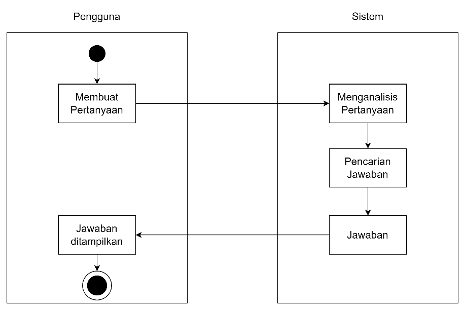
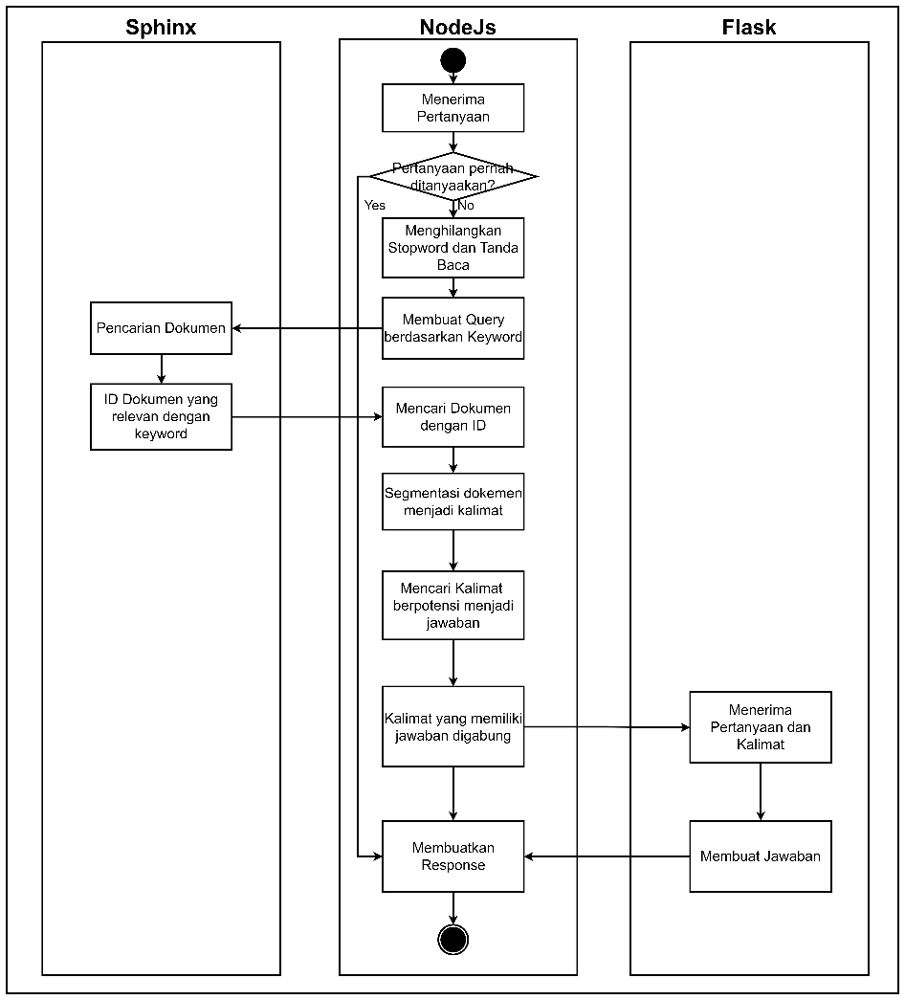
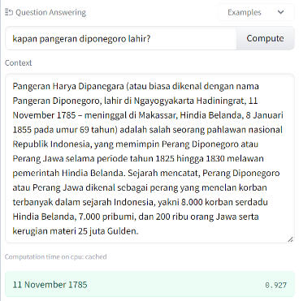
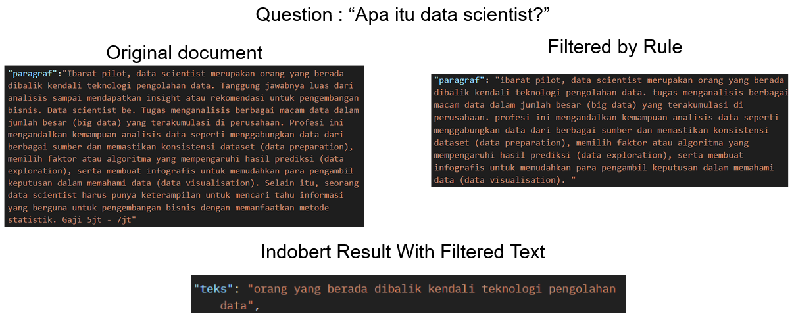
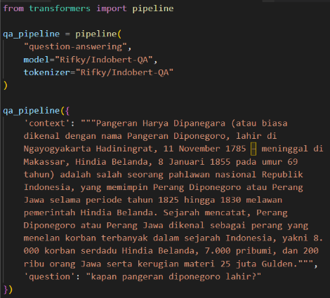
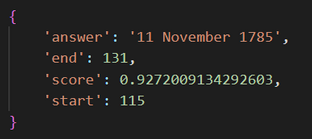

# QA
Ini adalah repository GitHub yang berisi implementasi sederhana dari Sistem Tanya Jawab (Question Answering System). Sistem ini dirancang untuk menerima pertanyaan dari pengguna dan memberikan jawaban yang sesuai berdasarkan pada koleksi dokumen yang telah disediakan.

# Daftar Isi
- [Introduction](#introduction)
- [Alur Kerja](#alur-kerja)
- [Rule Based System](#rule-based-system)
- [Indobert-QA](#indobert-qa)
- [Knowledge Base](#knowledge-base)
- [Information Retrieval](#information-retrieval)
- [Langkah Sistem Tanya Jawab](#langkah-sistem-tanya-jawab)

# Introduction
Sistem tanya jawab (question answering system) adalah sistem yang dirancang untuk menampilkan jawaban yang sesuai dengan pertanyaan dan konteks teks yang diberikan. Konteks teks adalah teks yang digunakan oleh sistem tanya jawab sebagai referensi untuk menjawab pertanyaan yang diberikan. Sistem tanya jawab dapat membantu dalam menjawab pertanyaan yang sering ditanyakan dengan menggunakan dokumen atau artikel tertentu. Ada beberapa jenis sistem tanya jawab berdasarkan cara mereka menangani cakupan pertanyaan:
1. **Extractive Question Answering**: Sistem tanya jawab ini menjawab pertanyaan berdasarkan dokumen yang telah diberikan.
2. **Closed-book Question Answering**: Sistem tanya jawab ini menghafal beberapa informasi dan dapat menjawab pertanyaan tanpa konteks teks yang langsung diberikan.
3. **Closed-domain Question Answering**: Sistem tanya jawab ini menjawab pertanyaan yang terbatas pada domain atau tema tertentu, seperti kesehatan atau otomotif, atau pertanyaan dengan batasan tertentu, seperti pertanyaan yang meminta deskripsi atau prosedur.
4. **Open-domain Question Answering**: Sistem tanya jawab ini menjawab berbagai jenis pertanyaan dan bergantung pada pengetahuan umum. Sistem ini biasanya memiliki data pengetahuan yang dapat diekstrak.

Dalam tugas akhir ini, sistem tanya jawab yang digunakan adalah sistem tanya jawab berbasis aturan. Sistem ini digunakan sebagai alat pencarian jawaban yang membantu pengguna dalam mencari jawaban atas pertanyaan yang mereka ajukan. Alur kerja sistem tanya jawab yang akan dibuat dijelaskan dalam Gambar 1 dan Gambar 2.

# Alur Kerja
**Gambar.1 alur kerja tanya jawab otomatis**



Gambar.1 menunjukkan alur kerja tanya jawab otomatis pada aplikasi. Pengguna pertama-tama menulis pertanyaan dan memasukkannya ke dalam sistem. Sistem menganalisis pertanyaan dan mencari jawaban yang sesuai dalam basis pengetahuan (knowledge base). Setelah menemukan jawaban, sistem mengembalikan jawaban tersebut kepada pengguna. Jawaban dalam basis pengetahuan berasal dari dua sumber, yaitu hasil crawling dari halaman web lain dan hasil tanya jawab yang dilakukan oleh pengguna dan narasumber.

**alur kerja tanya jawab otomatis**



Gambar.2 menjelaskan lebih rinci tentang teknik dan alur kerja saat sistem mencari jawaban untuk pertanyaan yang diberikan oleh pengguna. Ada tiga aktor yang terlibat, yaitu NodeJs, Sphinx, dan Flask. NodeJs menerima pertanyaan dari pengguna dan mencari apakah pertanyaan tersebut pernah ditanyakan sebelumnya. Jika iya, sistem akan mengirimkan kembali jawaban yang telah disimpan. Pertanyaan kemudian diolah untuk mendapatkan kata kunci atau kata kunci utama. Proses ini melibatkan penghapusan stopwords dan tanda baca. Setelah stopwords dihapus, sistem membuat query untuk pencarian menggunakan Sphinx. NodeJs mengirimkan query tersebut ke Sphinx untuk mencari artikel yang relevan dengan kata kunci. Artikel yang ditemukan oleh Sphinx berupa ID, dan NodeJs mencari artikel tersebut dalam database. Artikel yang ditemukan kemudian dipecah menjadi kalimat-kalimat. Kalimat-kalimat ini diperiksa dengan menggunakan aturan tertentu dan kata kunci untuk mencari kalimat yang berpotensi mengandung jawaban. Kalimat-kalimat ini digabungkan dan dikirim ke Flask untuk diproses menggunakan IndoBert-QA agar menghasilkan jawaban yang lebih baik. Flask mengirimkan responsnya kembali ke pengguna.

Dalam sistem tanya jawab biasanya terdapat enam tahapan proses, yaitu analisis pertanyaan, pra-pemrosesan koleksi dokumen, pemilihan dokumen kandidat, analisis dokumen kandidat, ekstraksi jawaban, dan pembuatan respons. Analisis pertanyaan bertujuan untuk memahami pertanyaan dan menghasilkan query yang akan digunakan dalam pencarian dokumen dan representasi semantik atau jenis informasi yang diinginkan dari pertanyaan tersebut. Pra-pemrosesan koleksi dokumen bertujuan untuk mengubah data untuk meningkatkan performa sistem. Pemilihan dokumen kandidat menggunakan query untuk mencari dokumen yang relevan. Analisis dokumen kandidat melibatkan pemrosesan dokumen untuk memisahkan kalimat, paragraf, atau kata untuk analisis lebih lanjut. Ekstraksi jawaban bertugas mencocokkan dokumen yang mungkin berisi jawaban yang sesuai dengan pertanyaan. Pembuatan respons melibatkan pembuatan respons yang akan diberikan kepada pengguna setelah mendapatkan jawaban.

# Rule Based System
Sistem Tanya Jawab Berbasis Rule adalah sistem yang menggunakan aturan tertentu untuk mencari kata kunci dalam jawaban suatu pertanyaan. Aturan-aturan ini berbeda tergantung jenis pertanyaan, seperti pertanyaan "apa", "berapa", atau "dimana". Setiap aturan memiliki bobot poin yang digunakan untuk menentukan jawaban. Aturan-aturan ini dapat dikelola dan disesuaikan oleh administrator dengan mengubah poin-poin pada setiap aturan serta menambahkan kata kunci yang penting untuk diperiksa oleh aturan. Proses selanjutnya adalah memilih kalimat-kalimat dengan poin lebih tinggi dari rata-rata poin kalimat-kalimat tersebut.

## Rule "APA"
Rule "APA" digunakan untuk menjawab pertanyaan tentang penjelasan suatu pekerjaan atau meminta penjelasan tentang sebuah pekerjaan. Rule ini akan memilih kalimat-kalimat yang mengandung jawaban yang ditentukan oleh aturan sistem tanya jawab. Rule ini melibatkan perhitungan jumlah kata kunci pada kalimat, pengecekan kata-kata yang menjelaskan setelah kata kunci, dan pengecekan kata-kata yang terkait dengan pekerjaan. Skor diberikan sesuai dengan poin yang ditetapkan pada aturan. 

| Rule  | Status | Keterangan                                         | Skor |
|-------|--------|----------------------------------------------------|------|
| 1     | Benar  | Kata backend dan developer berada pada kalimat tersebut | +2   |
| 2     | Benar  | Kata adalah berada setelah kata backend dan developer pada kalimat tersebut | +1   |
| 3     | Salah  | Tidak ada kata tugas atau kerja pada kalimat tersebut | +0   |
| 4     | Benar  | Kata backend dan developer berdekatan                   | +1   |
| Total |        |                                                    | 4    |

```
Segmen Program 3.1 Contoh Program Rule Apa
async function ruleApa(keyword, kalimat){
    let score = 0;
    let temp = []
    let kataPenjelasan = await executeQuery(`select kata from kata_kunci_rule where tipe = 'PENJELASAN'`)
    for (let i = 0; i < kataPenjelasan.length; i++) {
        const element = kataPenjelasan[i];
        temp.push(element.kata)
    }
    kataPenjelasan = temp      
    score+=wordCount(keyword, kalimat);
    let skip = false;
    keyword.forEach(element => {
        const kalimat2 = kalimat.split(element);
        kataPenjelasan.forEach(async kp => {
            if(kalimat2[1] && kalimat2[1].includes(kp)){
                if(skip){
                    const skor = await executeQuery(`select skor from rule where jenis_rule = 'APA' and rule = '1'`)
                    score += skor[0].skor;
                }
                skip = true;
            }
        })
    });
    let kataPekerjaan = await executeQuery(`select kata from kata_kunci_rule where tipe = 'PEKERJAAN'`)
    temp = []
    for (let i = 0; i < kataPekerjaan.length; i++) {
        const element = kataPekerjaan[i];
        temp.push(element.kata)
    }
    kataPekerjaan = temp
    for (let i = 0; i < kataPekerjaan.length; i++) {
        const element = kataPekerjaan[i];
        if((kalimat).includes(element)){
            const skor = await executeQuery(`select skor from rule where jenis_rule = 'APA' and rule = '2'`)
            score += skor[0].skor;
            i = kataPekerjaan.length;
        }
    }
    if(keyword.length>1){
        if(checkKedekatan(keyword, kalimat)){
            const skor = await executeQuery(`select skor from rule where jenis_rule = 'APA' and rule = '3'`)
            score += skor[0].skor;
        }
    }
    return score;
}
```
Tabel contoh dan segmen program di atas adalah contoh perhitungan skor dan implementasi rule "APA".

## Rule "BERAPA"
Rule "BERAPA" digunakan untuk menjawab pertanyaan tentang jumlah gaji pada suatu pekerjaan. Rule ini melibatkan perhitungan jumlah kata kunci pada kalimat, pengecekan kata-kata yang menjelaskan gaji, dan pengecekan satuan angka pada kalimat. Skor diberikan sesuai dengan poin yang ditetapkan pada aturan. 

| Rule  | Status | Keterangan                                                         | Skor |
|-------|--------|--------------------------------------------------------------------|------|
| 1     | Benar  | Kata gaji, backend, dan developer berada pada kalimat tersebut      | +3   |
| 2     | Benar  | Kalimat mengandung kata atau ejaan terhadap sebuah angka             | +1   |
| 3     | Benar  | Kalimat mengandung kata satuan dari angka yaitu jutaan               | +1   |
| Total |        |                                                                    | 5    |

```
Segmen Program 3.2 Contoh Program Rule Berapa
async function ruleBerapa(keyword, kalimat) {
    let score = 0;
    let temp = []
    let satuanAngka = await executeQuery(`select kata from kata_kunci_rule where tipe = 'SATUAN'`)
    for (let i = 0; i < satuanAngka.length; i++) {
        const element = satuanAngka[i];
        temp.push(element.kata)
    }
    satuanAngka = temp   
    const ejaanAngka = ["satu", "dua", "tiga", "empat", "lima", "enam", "tujuh", "delapan", "sembilan"]
    let skip = false;
    score+=wordCount(keyword, kalimat)
    if(feature.isContainsNumber(kalimat) || wordCount(ejaanAngka, kalimat) > 0){
        const skor = await executeQuery(`select skor from rule where jenis_rule = 'BERAPA' and rule = '1'`)
        score += skor[0].skor;
        satuanAngka.forEach(async sa => {
            if(kalimat && kalimat.includes(sa)){
                if(!skip){
                    const skor = await executeQuery(`select skor from rule where jenis_rule = 'BERAPA' and rule = '2'`)
                    score += skor[0].skor;
                    skip = true;
                }
            }
        })
    }    
    return score;
}
```
Tabel contoh dan segmen program di atas adalah contoh perhitungan skor dan implementasi rule "BERAPA".

## Rule "DIMANA"
aturan "DIMANA", digunakan untuk menjawab pertanyaan tentang bidang atau tempat kerja dari suatu pekerjaan. Algoritma tersebut menghitung skor berdasarkan beberapa kriteria, seperti keberadaan kata kunci tertentu dan pola tertentu dalam kalimat.

| Rule  | Status | Keterangan                                        | Skor |
|-------|--------|---------------------------------------------------|------|
| 1     | Benar  | Kata backend dan developer berada pada kalimat    | +2   |
| 2     | Benar  | Terdapat kata bidang                              | +1   |
| 3     | Benar  | Terdapat kata bekerja dan pada                    | +1   |
| Total |        |                                                   | 4    |

```
Segmen Program 3.1 Contoh Program Rule Dimana
async function ruleDimana(keyword, kalimat){
    let score = 0;              
    score += wordCount(keyword, kalimat)
    let temp = [] 
    let kataTempat = await executeQuery(`select kata from kata_kunci_rule where tipe = 'TEMPAT'`)
    for (let i = 0; i < kataTempat.length; i++) {
        const element = kataTempat[i];
        temp.push(element.kata)
    }
    kataTempat = temp
    for (let i = 0; i < kataTempat.length; i++) {
        const element = kataTempat[i];
        if((kalimat).includes(element)){
            const skor = await executeQuery(`select skor from rule where jenis_rule = 'DIMANA' and rule = '1'`)
            score += skor[0].skor;
            i = kataTempat.length;
        }
    } 
    if(kalimat.includes('bekerja')){
        let kataAwalanTempat = await executeQuery(`select kata from kata_kunci_rule where tipe = 'AWALANTEMPAT'`)
        temp = []
        for (let i = 0; i < kataAwalanTempat.length; i++) {
            const element = kataAwalanTempat[i];
            temp.push(element.kata)
        }
        kataAwalanTempat = temp
        for (let i = 0; i < kataAwalanTempat.length; i++) {
            const element = kataAwalanTempat[i];
            if((kalimat).includes(element)){
                const skor = await executeQuery(`select skor from rule where jenis_rule = 'DIMANA' and rule = '2'`)
                score += skor[0].skor;
                i = kataAwalanTempat.length;
            }
        } 
    }
    return score;
}
```

Tabel contoh dan segmen program di atas adalah contoh perhitungan skor dan implementasi rule "DIMANA".

# IndoBERT-QA
IndoBERT-QA adalah versi fine-tuned dari model IndoBERT untuk tugas downstream Question Answering (Q&A). Model ini dilatih oleh IndoLEM dan fine-tuned pada SQuAD 2.0 yang telah diterjemahkan.

## Tentang IndoBERT
IndoBERT adalah versi Indonesia dari model BERT dan dilatih menggunakan lebih dari 220 juta kata yang dikumpulkan dari tiga sumber utama: Wikipedia Indonesia, artikel berita dari Kompas, Tempo, dan Liputan6, serta Korpus Web Indonesia.

IndoBERT-QA akan digunakan untuk membuat respons terhadap pertanyaan pengguna menggunakan teks konteks yang dihasilkan dari proses penerapan aturan. Ini akan memungkinkan pengguna untuk mendapatkan jawaban hanya dengan mengajukan pertanyaan dan memberikan teks konteks.

Untuk menggunakan model ini, Anda dapat mengunduhnya melalui [Hugging Face](https://huggingface.co/Rifky/Indobert-QA) dengan menggunakan pipeline “question-answering” dan menentukan model dan tokenizer sebagai “Rifky/Indobert-QA” 

### Indobert-QA menjawab sebuah pertanyaan




### Implementasi Indobert-QA dalam kode


### Jawaban Indobert-QA


# Knowledge Base
Knowledge base adalah tempat penyimpanan digital untuk kumpulan pengetahuan atau knowledge. Di dalam knowledge base, pengetahuan dapat disimpan dalam bentuk artikel, dokumen, video, dan tanya jawab. Sumber pengetahuan dalam knowledge base biasanya berasal dari para ahli dalam bidangnya yang menjawab pertanyaan. Pengetahuan dalam knowledge base akan bervariasi tergantung pada jumlah dan lamanya data yang dikumpulkan. Setiap kali muncul sebuah masalah dan ada yang dapat menjawabnya, pengetahuan baru akan ditambahkan ke knowledge base.

Penggunaan knowledge base membantu pengguna mencari pengetahuan yang mereka butuhkan tanpa harus menunggu balasan, sehingga dapat mempercepat pencarian pengetahuan. Knowledge base sering digunakan dalam customer service atau situs web dengan opsi untuk mencari pertanyaan yang sering diajukan. Jika pengguna ingin mengetahui penjelasan tentang suatu pekerjaan tertentu, mereka tidak perlu bertanya langsung kepada narasumber atau ahli, melainkan dapat menggunakan pertanyaan mereka dan sistem akan mencari dokumen yang menjelaskan jawaban tersebut.

Knowledge base dapat melakukan pencarian terhadap pertanyaan-pertanyaan yang telah diajukan dan dijawab yang memiliki kesamaan dengan pertanyaan yang sedang diajukan saat ini. Pencarian juga dapat dilakukan menggunakan kata kunci atau menggunakan alat kecerdasan buatan seperti sistem pakar (dengan aturan if-then), jaringan saraf tiruan (pembelajaran otomatis), case-based reasoning (mencocokkan pola), dan pemrosesan bahasa alami (pengenalan bahasa).

Dalam tugas akhir ini, knowledge base akan dibentuk dengan menyimpan artikel yang telah di-crawl serta hasil tanya jawab yang dilakukan pada aplikasi oleh narasumber dan penanya. Artikel tersebut berupa halaman web yang awalnya di-crawl, dan kemudian admin dapat menambahkan artikel baru. Tanya jawab akan ditambahkan secara otomatis setiap kali penanya membuat pertanyaan baru atau mengakuisisi pengetahuan dari tanya jawab yang telah ada, dan narasumber akan menyimpan pengetahuan tersebut secara langsung.

Sphinx adalah sebuah perangkat lunak search engine yang memungkinkan pencarian berdasarkan kata kunci dengan cepat menggunakan metode indexing. Sphinx tidak berjalan langsung dengan database, tetapi mengambil data dari database utama dan menyimpannya dalam file di sistem Sphinx sebagai indeks. Untuk melakukan pencarian, Sphinx menggunakan program searchd.exe sebagai search daemon. Searchd berfungsi sebagai pendengar untuk server Sphinx, sehingga server Sphinx dapat terhubung langsung dengan MySQL. Searchd dapat diakses menggunakan bahasa khusus untuk Sphinx yang disebut SphinxQL. SphinxQL mirip dengan SQL umum yang dapat melakukan perintah SELECT, INSERT, REPLACE, dan DELETE.

Indexing pada Sphinx dilakukan sebelum dapat melakukan pencarian menggunakan query Sphinx. Proses indexing bertujuan mempercepat kinerja search engine tool. Hasil dari proses indexing menghasilkan indeks. Sphinx menggunakan inverted index sebagai metode indexing. Inverted index adalah cara indexing di mana kata kunci tertentu mewakili dokumen-dokumen yang mengandung kata kunci tersebut. Index file yang terbentuk akan mencatat dokumen

# Information Retrieval
Information retrieval (IR) adalah kegiatan untuk mendapatkan informasi dari berbagai dokumen teks yang tidak terstruktur. IR berguna dalam mencari informasi dalam kumpulan dokumen seperti pada search engine, buku elektronik, atau email. Clustering dan classification adalah proses penting dalam IR untuk mengelompokkan dan mengkategorikan dokumen berdasarkan isi dan topiknya.

Terdapat tiga jenis skala ukuran data yang umum digunakan dalam IR:

1. **Web Search**: IR pada miliaran dokumen di seluruh dunia, membutuhkan sistem yang efisien dan dapat menangani masalah di web, termasuk pengindeksan dan ranking.
2. **Personal Information Retrieval**: IR pada data pribadi seperti email dan dokumen di komputer pribadi. Fokus pada metode pencarian yang ringan dan penanganan berbagai tipe dokumen.
3. **Enterprise, Institutional, dan Domain-specific Search**: IR pada dokumen perusahaan atau institusi, dengan kebutuhan data tersentralisasi dan fitur pencarian yang tepat.

Search engine adalah salah satu aplikasi IR yang digunakan pada skala web search. Metode ranking digunakan untuk mengurutkan dokumen berdasarkan relevansinya dengan query yang dimasukkan. Term frequency dan inverse document frequency digunakan untuk menentukan relevansi term terhadap dokumen. Knowledge base juga membantu IR dengan menyimpan pengetahuan terstruktur yang dapat diakses oleh komputer.

# Langkah Sistem Tanya Jawab
Berikut adalah langkah-langkah sistem tanya jawab yang dibuat dalam tugas akhir ini:
1. **Penentuan Jenis Pertanyaan**: Identifikasi jenis pertanyaan yang diinputkan, seperti "APA", "BERAPA", atau "DIMANA".
2. **Pemrosesan Pertanyaan**: Hilangkan tanda baca dan stopwords pada pertanyaan untuk memperoleh keyword yang relevan.
3. **Pembentukan Query**: Gunakan keyword yang telah didapatkan untuk membentuk query yang akan dijalankan pada Sphinx untuk mendapatkan artikel atau dokumen terkait.
4. **Pencarian dengan Sphinx**: Jalankan query pada Sphinx dan peroleh ID dari dokumen yang relevan.
5. **Pengambilan Artikel**: Ambil artikel atau dokumen lengkap berdasarkan ID yang diperoleh dari Sphinx.
6. **Segmentasi Kalimat**: Lakukan segmentasi pada setiap artikel berdasarkan kalimat atau paragraf.
7. **Pemberian Rule**: Berikan aturan atau rule yang sesuai dengan jenis pertanyaan yang telah ditentukan pada tahap pertama.
8. **Pemberian Skor**: Berikan skor atau poin pada setiap kalimat yang memenuhi aturan. Gabungkan kalimat dengan skor di atas rata-rata untuk digunakan pada tahap selanjutnya.
9. **Penggunaan Model IndoBert-QA**: Kirimkan kalimat yang telah digabung ke layanan Flask. Layanan Flask akan menggunakan model IndoBert-QA untuk menghasilkan
10. **Penyediaan Jawaban Tambahan**: Selain hasil sistem tanya jawab otomatis dari model IndoBert-QA, sistem juga akan mengambil tanya jawab dan informasi dari API pihak ketiga sebagai jawaban tambahan.

Setelah semua respons siap, sistem akan mengirimkan respons tersebut kepada pengguna dan menampilkannya melalui React Native.
